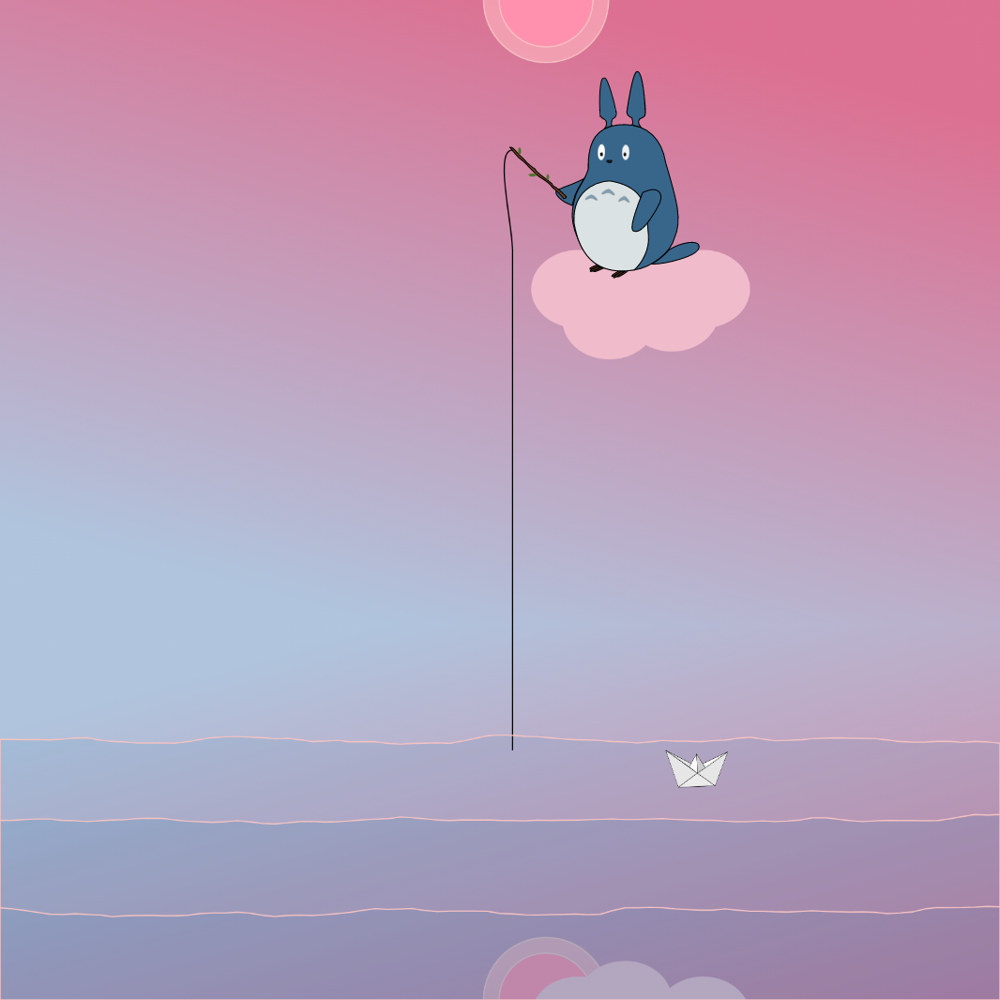

# Fishing for Your Dreams

### Description
Equally serene and minimal, our project hopes to invoke an impactful calmness byways through the simple yet quirky interaction within it. 

**insert Picture here**

### Directions

1. Use the mouse to change the sky
2. Use the left and right arrows to move the boat
3. Try moving them simultanesouly at the same     speed, following each other. 
4. Enjoy c:

## Authors
Ethan Lan and Vicky Oury

## Acknowledgements
SVG Animation resource: https://www.youtube.com/watch?v=k4Fd3gR7Z5A

Examples we referenced:
1. https://p5js.org/examples/math-noise-wave.html
2. https://p5js.org/examples/input-easing.html
3. https://p5js.org/reference/#/p5/keyIsDown
4. https://p5js.org/reference/#/p5/curveVertex
5. https://p5js.org/learn/curves.html
6. https://p5js.org/reference/

## License

MIT
